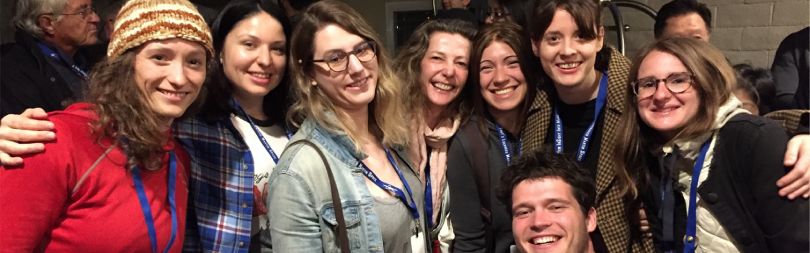

---
jupytext:
  cell_metadata_filter: all
  main_language: python
  notebook_metadata_filter: all,-toc,-latex_envs
  text_representation:
    extension: .md
    format_name: myst
    format_version: '0.8'
    jupytext_version: 1.4.2
kernelspec:
  display_name: Python 3
  language: python
  name: python3
language_info:
  codemirror_mode:
    name: ipython
    version: 3
  file_extension: .py
  mimetype: text/x-python
  name: python
  nbconvert_exporter: python
  pygments_lexer: ipython3
  version: 3.7.6
---


# Slide 0
```

EOSC 211:  Computer Methods in Earth, Ocean and Atmospheric Sciences

Week 1:  Introduction
Today’s Class:
Introductions
Logistics:
syllabus, text, computer accounts, grading, workload, notes
Why MATLAB?
What can we do with it?
In-class exercise
Problem solving
To Do for next time

```

+++


# Slide 1
```

Who We Are and What We Do
Instructors: Catherine Johnson and Rich Pawlowicz
TAs: Georgia Peterson, Sam Stevens, Geena Littel

```




+++

# Slide 2
```

Course Logistics - I
…See course syllabus for details
Canvas
We will use Canvas for disseminating notes, worksheets, labs etc and for you to hand stuff in.
Class is built around labs:
“lectures” are mostly paper worksheets to prepare for labs (RP or CJ)
Tuesday class introduces concepts, Thursday summarizes…
“labs” are computer work, modeled to be “pieces” of a real problems.  At least one instructor usually present plus TAs.
Assignments:
like labs but more complex – like real problems.
Mid-term + final are like in-class worksheets

```


+++

# Slide 3
```

Course Logistics - II

```


+++

# Slide 4
```

Course Logistics - III
…See course syllabus for details
Group Work class/exams
we will assign you a group (4-5 people/group)
we will use groups for in-class work
also a group component to exams
“Pair Programming” in Labs
just like it sounds, work in pairs
enforced in first few labs, later up to you
assignments will be done in pairs (or max groups of 3)
Collaboration, Copying and Plagiarism Policy
“For labs we encourage collaboration using a pair-programming method. However, you are expected to TRUTHFULLY REPORT: the name of your partner(s), and the level of collaboration. Using someone else’s code and claiming it as your own is plagiarism and will be treated as such.”

```


+++

# Slide 5
```

Course Logistics - IV
…See course syllabus for details
Final Assessment
Labs 30%; assignments 25%, midterm 15%, final 25%; mini-quizzes 5%
IF you fail individual parts of midterm / final combined you fail the course.
Labs
9, but week 2 not graded and final mark is best 7 of remaining 8
Graded out of 10 – usually one of 10/8/5/0 mark
Due ELECTRONICALLY 4pm Fridays, they take more time then the 2-hr lab section
Assignments
2 of them 2 weeks each,
Letter grade
Due ON PAPER 4pm Wednesdays (except Part 1 of A1 which is due on Mon 10/22).
Exams: Mid-term (in class) and Final (during exams)
80% individual, 20% group

```

+++


# Slide 6
```

Course Logistics - V
…See course syllabus for details
Getting access to MATLAB
need either an EOS account $25 for year
…OR…
Install MATLAB on your laptop and bring it to the lab (free for UBC students this year)
Textbook (required)
TEXT: MATLAB: A Practical Introduction to Programming and problem Solving.  At bookstore.
NB: The old text is “Problem Solving using MATLAB”  (a custom text, no longer in print)

```


+++

# Slide 7
```

Course Logistics - VI
Wait list
Moved everyone from waitlist into course last week.
Course is now FULL:  waitlist is blocked and if you’re not in the course already you will NOT get in.

```


+++

# Slide 8
```

Why MATLAB?
What will you be able to do at the end of the course?
But Now to More Fun Stuff…..

```

+++


# Slide 9
```

Why MATLAB?

```


+++

# Slide 10
```

Why MATLAB?
What will you be able to do at the end of the course?
write computer programs to model and analyze data in the earth sciences
But Now to More Fun Stuff…..

```

+++


# Slide 11
```

Examples ….
plotting:  time series, geographically, histograms, contour plots
extract data from given geographical region
smooth data; deal with data gaps; compute variability in data
compute a simple model and see how well it fits your data

```


+++


# Slide 12
```

Examples ….
Here’s an example of a data set where physics predicts that the quantity on the y axis will increase as the quantity on the x-axis increases.
…hmmm.… well kinda… but……
my points are hard to see – I could improve my plot
what is all the scatter?

```


+++


# Slide 13
```

Examples ….
I suspect that another quantity that I also measure might be playing a role.  I can color-code my points by this quantity:
Now we can see that indeed this quantity is important.
When it is high (reddish points) the quantity on the y-axis is systematically lower and vice versa

```


+++


# Slide 14
```

…a complicated figure comparing 3 different data sources measuring currents at different palces and times in the Strait of Georgia…

```


+++


# Slide 15
```

…or plot on a map to see spatial trends!

```


+++

# Slide 16
```

Why MATLAB?
What will you be able to do at the end of the course?
write computer programs to model and analyze data in the earth sciences
What we have to practice to get to this…
Breaking down a problem into a set of logical steps (an algorithm)
Writing and debugging MATLAB programs to implement your algorithm
Modifying existing code to make it more readable /efficient / well-documented
Creating scientifically informative and appealing plots
But Now to More Fun Stuff…..

```


+++

# Slide 17
```

Worksheet

```

+++


# Slide 18
```


```


+++

# Slide 19
```

5 Steps in Solving a problem
State the problem clearly
Describe inputs and outputs
Work the problem by hand for a simple set of data
Develop a MATLAB solution
Test with a variety of data

```


+++

# Slide 20
```

To DO for next week:
BEFORE first lab
get computer account - $25:  go to front desk in Earth Sciences Building, Room 2020, 9:00am-11:30 or 2:00-4:00pm
See Ian or Alicia
Exact cash only
OR
Install MATLAB on your laptop (free for UBC students)
BEFORE TUES CLASS:
Week02 reading
Pg 3-40, 75-80, 89-101 (parts of Chaps 1-3), and skim 557-564 (Appendix 1).

```
