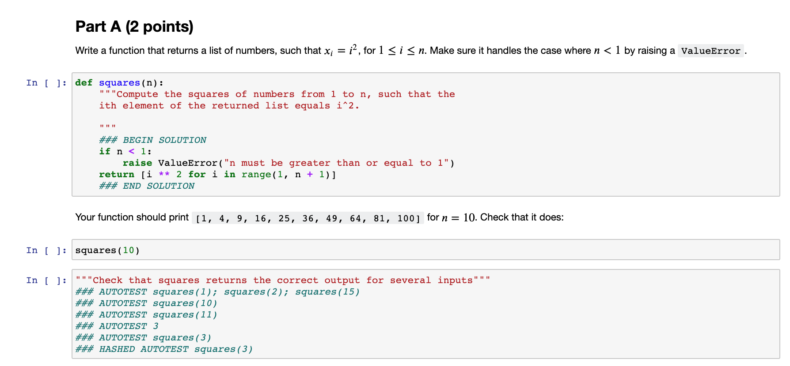
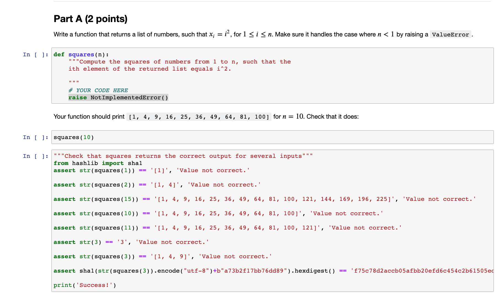

It uses templating for an object type, to create an expected set of tests for such an object type in the future. For example, here's the template for tests for a list (you would put the template in the source/assignment directory and name it tests.yml:

    setup: "from hashlib import sha1"
    hash: 'sha1({{snippet}}.encode("utf-8")+b"{{salt}}").hexdigest()'
    dispatch: "type({{snippet}})"
    normalize: "str({{snippet}})"
    check: "assert {{snippet}} == '{{value}}', '{{message}}'"
    success: "print('Success!')"
    templates:
        default: 
            - test: "{{snippet}}"
              fail: "Value not correct."
        string:
            - test: "{{snippet}}"
              fail: "String doesn't align"
            - test: "len({{snippet}})"
              fail: "length not correct"

And then your source notebook would look like this: 

And when you run the nbgrader generate_assignment command, it would make the release (student) notebook that looks like this:

I think we should plan to use this for the port of DSCI 100 to Python, instead of hand writing all the tests - we will make a lot of mistakes if we hand-write this!
