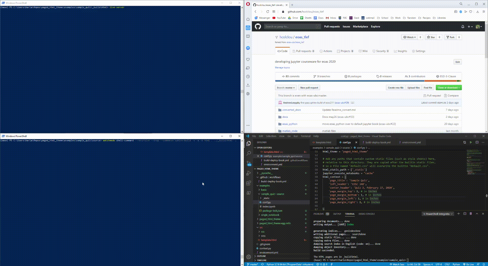

# Use Watchdog and a Live Server to automatically build and display your Notebooks in real time
## Installing watchdog, Node.js, and live-server

1. install watchdog:
```
pip install watchdog
```

2. install Node.js from [here](https://nodejs.org/en/) or using:
```
choco install nodejs
```

3. install live-server:
```
npm install -g live-server
```

## Example process of running watchdog and live-server for sphinx-build
1. open a terminal and cd to your notebook source folder
2. run: (where '../_build/html' is the output folder of the build)
```
watchmedo shell-command --recursive --drop --command='sphinx-build -v -a -b html . ../_build/html' .
```

3. open a second terminal and cd to your notebook build folder
4. run:
```
live-server
```

5. now update any source files and the book will automatically build and refresh

## Screen Capture of the example process

